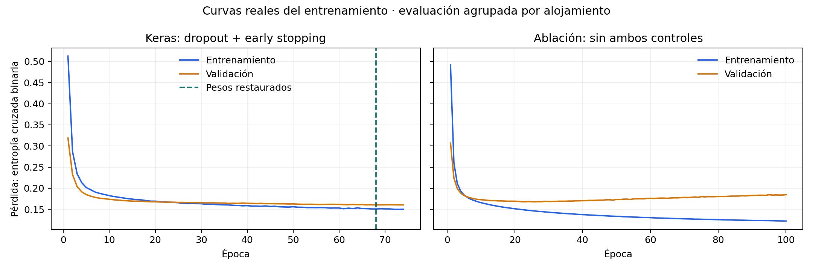

# Nivel 2 — Red neuronal Keras · Problema 2

## Cumplimiento de la asignación

| Requisito | Implementación y evidencia |
|---|---|
| MLP en Keras sobre representación densa | `tf.keras.Sequential`; TF-IDF → TruncatedSVD(64) + longitud → StandardScaler. |
| Reducir TF-IDF para texto | `TruncatedSVD(n_components=64, random_state=20261004)` dentro del pipeline. |
| Arquitectura documentada | Entrada 65; una capa oculta Dense(64, ReLU); Dropout(0.20); salida Dense(5, sigmoid); Adam(learning_rate=0.001). |
| Curvas de pérdida y early stopping | `datos/perdida_keras.csv`, `datos/curvas_perdida.png`; callback monitor val_loss, paciencia 6, min_delta 0.0001, restore_best_weights=True. |
| Tratamiento del sobreajuste y evidencia | Curvas, pérdidas comparables en inferencia y ablación sin dropout ni parada anticipada; resultados abajo. |
| Boosting con igual presupuesto para tabular/series | No aplica: este proyecto clasifica texto. Mantiene regresión logística y SVM como modelos clásicos. |

## Arquitectura y entrenamiento

La entrada contiene **64 componentes SVD del TF-IDF y una variable de longitud**: 65 números por reseña. El vocabulario, TF-IDF, SVD y escaladores se ajustan solo en entrenamiento. La longitud es log(1 + caracteres), escalada. Los 64 componentes explican 29.0% de la varianza de la representación TF-IDF de entrenamiento.

El modelo seleccionado tiene **una capa oculta de 64 unidades ReLU y una capa de salida de 5 unidades sigmoid**. Son dos capas Dense; Dropout es una capa adicional de regularización y no una capa Dense. Dropout apaga aleatoriamente 20% de las activaciones de la capa oculta durante entrenamiento; en inferencia está desactivado. La salida sigmoid permite detectar varios temas simultáneamente. No se usa softmax porque los temas no son excluyentes.

- Optimizador: Adam, tasa de aprendizaje 0.001.
- Pérdida: binary_crossentropy, adecuada para cinco etiquetas binarias.
- Batch: 128. Máximo: 100 épocas. Semilla: 20261004.
- EarlyStopping: monitor='val_loss', mode='min', patience=6, min_delta=0.0001, restore_best_weights=True.
- Se compararon (64) con dropout 0.20 y (128, 64) con dropout 0.30. La elección fue por Macro F1 en validación automática. Ambos candidatos recibieron el mismo máximo de épocas y la misma regla de parada. El gasto efectivo varía por early stopping.
- Implementación: TensorFlow 2.21.0 y Keras 3.15.1.

## Particiones y prevención de fuga de información

De 25 000 reseñas con etiquetas automáticas, **19,931** pertenecen al entrenamiento y **5,069** a validación. Hay 6,440 alojamientos para entrenar y 1,610 para validar, con cero alojamientos compartidos. Los alojamientos y textos normalizados de las 100 reseñas humanas están excluidos del entrenamiento automático. Las etiquetas humanas se usan solo después de seleccionar el modelo.

Las etiquetas de entrenamiento provienen de reglas de palabras y pueden estar equivocadas. La validación automática orienta la selección; el resultado humano estima la coincidencia con anotaciones manuales de una muestra pequeña y dirigida. No es una estimación ciega de toda la población.

## Curvas de pérdida y early stopping aplicado

La red seleccionada ejecutó **74 de 100 épocas**. Early stopping se activó y restauró los pesos de la época **68**, seleccionada por el callback al considerar min_delta. La pérdida de validación del modelo restaurado fue **0.160510**, frente a **0.160791** en la última época ejecutada. La parada evitó 26 épocas adicionales y conservó el checkpoint de validación escogido, en lugar de los pesos finales.

Los CSV contienen todas las épocas realmente ejecutadas, sin suavizado ni valores inventados. Las pérdidas de entrenamiento registradas en fit incluyen dropout activo; las de validación lo desactivan. Por eso, la brecha comparativa de la tabla siguiente se calcula con **training=False en ambos conjuntos** y no restando directamente las curvas.

## Tratamiento del sobreajuste y evidencia de efectividad

El sobreajuste ocurre cuando el modelo sigue adaptándose al entrenamiento sin mejorar en reseñas que no vio. Se usaron: (1) SVD para reducir dimensionalidad, (2) dropout para reducir dependencia de activaciones concretas, (3) early stopping con restauración de pesos, y (4) separación de alojamientos y transformaciones ajustadas solo en entrenamiento.

Para observar su efecto se ejecutó una **ablación exploratoria** con la misma arquitectura oculta de 64 unidades, los mismos datos, representación, semilla, Adam, batch y umbral; se desactivaron dropout y early stopping y se entrenó durante las 100 épocas. La ablación no se evaluó en el test humano ni se utilizó para reajustar el modelo seleccionado.

| Medida comparable (dropout desactivado al medir) | Dropout + early stopping | Sin ambos controles, 100 épocas |
|---|---:|---:|
| Pérdida de entrenamiento | 0.138363 | 0.120102 |
| Pérdida de validación | 0.160510 | 0.184613 |
| Brecha validación − entrenamiento | 0.022147 | 0.064511 |

En esta ejecución, los controles redujeron la pérdida de validación **13.1%** frente a la ablación y estrecharon la brecha. Sin controles, la red consiguió menor pérdida de entrenamiento pero mayor pérdida de validación: evidencia compatible con sobreajuste. **Esto respalda la efectividad conjunta de los controles sobre la pérdida en esta partición**, sin aislar el efecto de cada uno ni garantizar mejora en todas las métricas o poblaciones.

La ablación alcanzó Macro F1 automático 0.623, mientras que el modelo seleccionado obtuvo 0.612. Reducir binary crossentropy **no garantiza** mejorar el F1 con umbral fijo 0.5. Esta diferencia se conserva; no se ajustaron umbrales con las etiquetas humanas. La comparación utiliza una sola semilla y requiere repeticiones para una conclusión robusta. No se afirma que SVD haya mejorado por sí solo: no se hizo ablación específica de SVD.

## Evaluación humana de la red seleccionada

Macro F1: **0.635**. Micro F1: **0.750**. Coincidencia completa de las cinco etiquetas: **47%**. Los modelos clásicos siguen superando a la red en esta muestra; no se oculta ese resultado.

## Reproducir

1. Instala requirements.txt con Python 3.11 o 3.12.
2. Coloca tu Excel original Etiquetados.xlsx junto a app.py.
3. Ejecuta `python preparar_excel.py` para reconstruir las muestras (no publicadas).
4. Ejecuta `python entrenar.py` para repetir entrenamiento y evaluación. `--solo-red` conserva los clásicos existentes y repite solo la parte neuronal.
5. Ejecuta `python generar_informe.py` para regenerar este informe y la figura a partir de los resultados.
6. Ejecuta `streamlit run app.py`. La inferencia usa el modelo Keras guardado y su preparación original; no entrena al abrir la app.

Los archivos en modelos/keras_pre.part* son fragmentos del preparador serializado, no datos originales. El manifiesto verifica tamaño y SHA-256. red_keras.keras conserva la red realmente entrenada con los pesos restaurados. Se usa tf.keras.models.load_model(..., compile=False) y training=False para inferencia. La implementación anterior con MLPClassifier se retira del despliegue.

## Referencias técnicas

- [Keras EarlyStopping](https://keras.io/api/callbacks/early_stopping/)
- [Keras Dropout](https://keras.io/api/layers/regularization_layers/dropout/)
- [TruncatedSVD de scikit-learn](https://scikit-learn.org/stable/modules/generated/sklearn.decomposition.TruncatedSVD.html)
